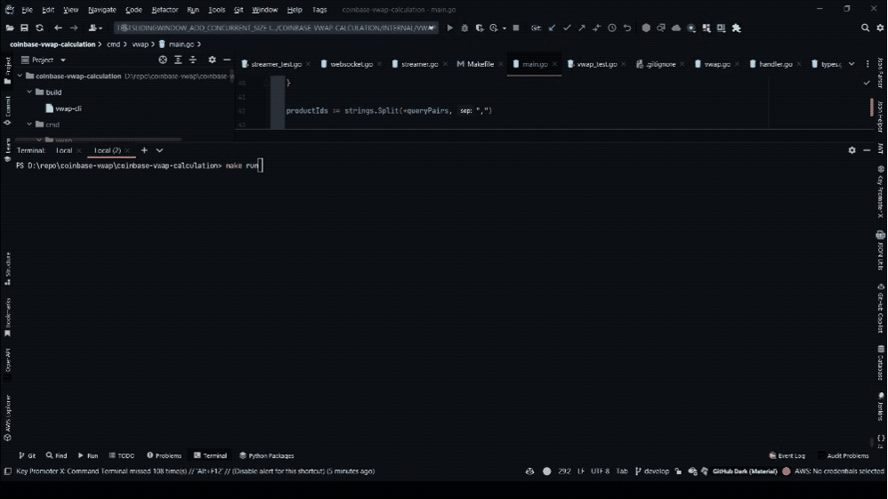
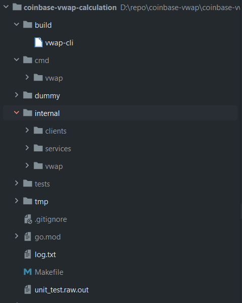

# Coinbase VWAP Price Streamer/Calculator

This project is a simple tool for calculating and streaming VWAP prices for given set(s) of crypto pairs.

It's utilizing the [Coinbase websocket API](https://docs.cloud.coinbase.com/exchange/docs/websocket-overview) to fetch the VWAP calculation.



# Usage

The commands running the project are managed using the Makefile.

Check the Makefile for details.

## Commands

```
make install
```

Install the dependencies.

```
make run
```

Run the main program.

The additional command args can be used are:

- `pairs`: comma separated list of pairs to calculate VWAP for. Default: `"BTC-USD,ETH-USD,ETH-BTC"`
- `verbose`: print verbose output. Default: false.
- `wsurl`: websocket url to use. Default: `"wss://ws-feed.exchange.coinbase.com"`
- `window-size`: The sliding window size for holding a set of datapoints to use in VWAP calculation. Default: `200`

```
make build
```

Build the binary, once it's built, the cli binary can be found in the build directory.

```
make clean
```

Remove the build artifact.

```
make test
```

Run the go tests with coverage and race condition check.

```
make lint_ci
```

Run the golangci-lint linter. [golangci-lint](https://golangci-lint.run/) must be installed prior to running this command.

```
make linter_install
```

This installs golangci-lint.

# Design Considerations

## Project Structure

The project is structured as follows:



- cmd directory - contains the command line entry point.
- internal directory - contains the internal components of the project.
    - client directory - contains the general client code.
    - services directory - contains the service and service handler code.
- vwap directory - contains the VWAP calculation code and its related utilities.
- build directory - contains the build artifact.

## Components and design explanation

* VWAP coinbase downstream service including the client and the handler - subscribe to a Coinbase websocket feed and stream the price data.
* VWAP calculator - calculates the VWAP for a given datapoint window.
* The command line entry point - the `main.go` file brings all the components together.

### Generic Clients

  In `internal/clients` directory, there's a generic websocket client for connecting and getting the websocket feeds.

  It's generic, meaning that it can be used for any websocket downstream communications.

  For future extensions, more generic client packages such as general gRPC and REST clients can be added in `internal/client` directory.

### Downstream Services

  In `internal/services` directory, there's a streaming service for providing the aggregated VWAP data to the other consumer components of the project.

  A basic service consists of a service handler and a stream client, the service handler is responsible for handling the incoming data and the stream client is responsible for connecting to the websocket feed.

  The streaming service interfaces are provided in `internal/services/streaming/interface.go` file for unifying the future implementation of additional services from different exchanges.

  The service handler `CoinbaseSteamDataHandler` has a `messagePipelineFunc` function property, that can be further implemented to handle the data pipelining for sending it to a message queue or a database.

### VWAP Calculation
  
  In `internal/vwap` directory, `vwap.go` file contains the VWAP data structure and the calculation logic.

  - `vwap.go` file contains the VWAP sliding window data structure and the calculation logic.
  - `utils/vwavg_calculator.go` file contains the VWAP calculation utilities.
  
  The `SlidingWindow` is a fixed size window that holds a set of data-points of a particular currency pair to use in
  calculating the VWAP. The `SlidingWindow` is implemented as a FIFO queue-like data structure, with a VWAP calculator
  object attached to it holding the total volume and price data for the current window.
  
  For performance optimization, the VWAP calculator is always holding the current total volume and the total price
  coming from all the data-points within the sliding data window. The total price and volume data are maintained whenever
  a new datapoint is added to the sliding window and/or an old datapoint is removed from the sliding window. By doing so,
  no iteration/looping of the datapoint slice is required to get the latest total price and volume information, making
  the calculation of the VWAP a simple addition and subtraction of the price and volume data. This effectively make the
  calculation of the VWAP a constant time operation with a time complexity of O(1).

### Currency and floating point precision

  For financial and currency calculations, the precision of the floating point numbers is important to avoid decimal
  fraction problems.

  At ANZ, we use the `[anz-bank/decimal](https://github.com/anz-bank/decimal)` package to handle the floating point
  precision and conversion.

  However, since the project is really simple one with only a few calculations upon receiving price data, so we just use
  a common `big.Float` data precision form `math/big` package.
